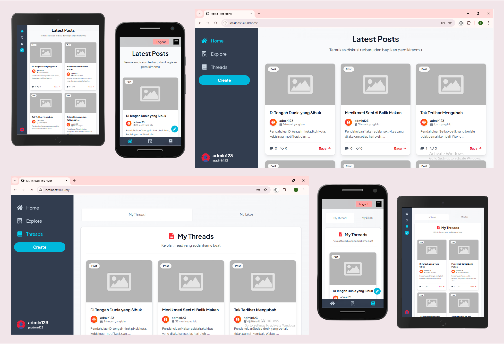
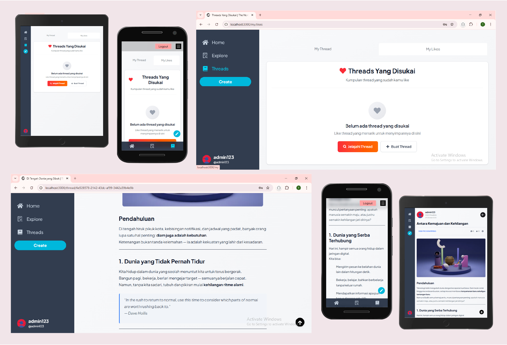
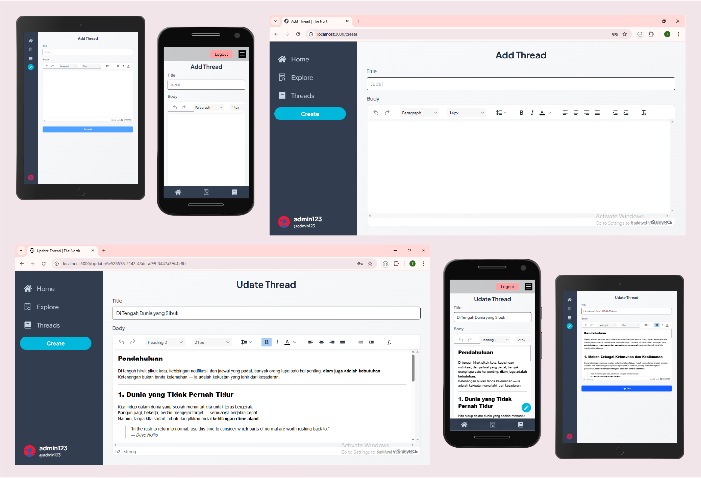
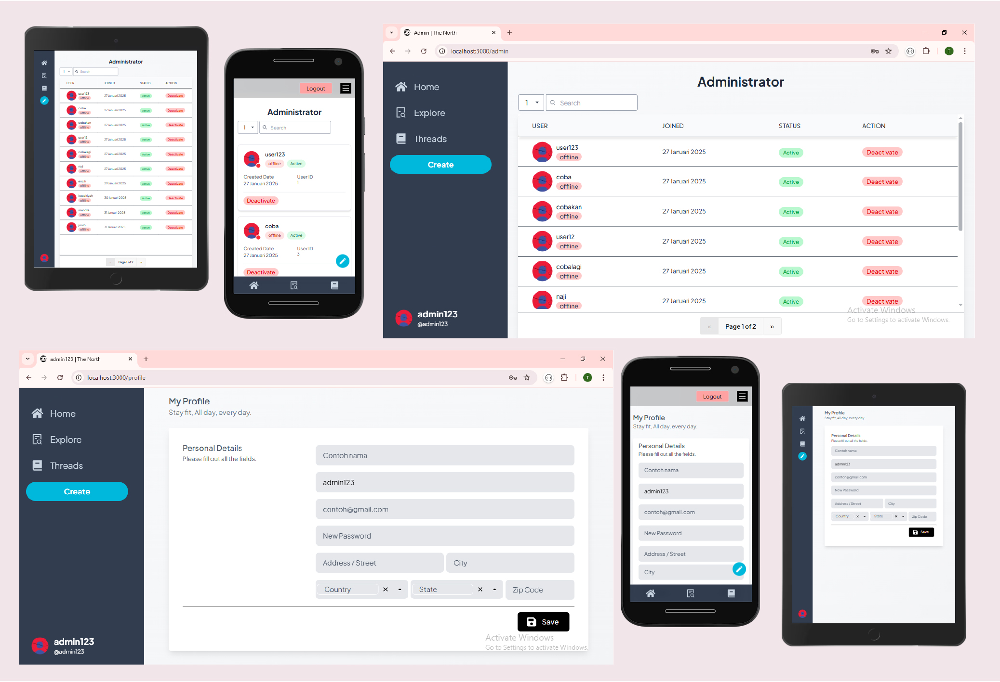

# Project Nextjs | Tailwind

Frontend => [here](https://thenorth.vercel.app/)
Backend => [here](https://github.com/haetamm/thenorth-api/tree/docker.setup)

---

## 📋 Project Setup

### Prerequisites
- Docker & Docker Compose installed
- Node.js 22+ (if running locally without Docker)

### 1. **Initial Setup**

Clone the repository:
```sh
git clone <repository-url>
cd thenorth
```

### 2. **Create Environment File**

Copy and edit the environment file:
```sh
cp .env.example .env
```

Edit `.env` with your configuration:
```env
API_KEY_EDITOR= // api key tinymce/tinymce-react [text editor]
NEXT_PUBLIC_API_BASE_URL=http://localhost:8000/api/v1 #API backend url
```

---

## 🐳 Development Setup (With Docker) - RECOMMENDED

### 1. **Start Docker Containers**

Build and start the containers:
```sh
docker-compose -f docker-compose.dev.yml up --build
```

---

## 🏗️ Production Setup (With Docker) - RECOMMENDED

### 1. **Start Docker Containers**

Build and start the containers:
```sh
docker-compose -f docker-compose.prod.yml up --build
```

---

## **Access the Application**

Open your browser and go to:
- **Open**: [http://localhost:3000](http://localhost:3000) with your browser to see the result.

---

**Happy Coding! 🚀**

<br>

<div align="center">
  
</div>

<br>

<div align="center">
  
</div>

<br>

<div align="center">
  
</div>

<br>

<div align="center">
  
</div>
